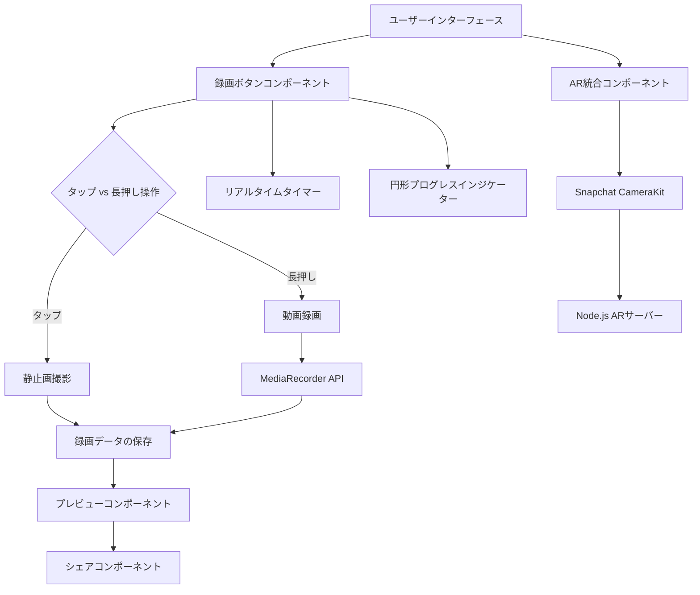
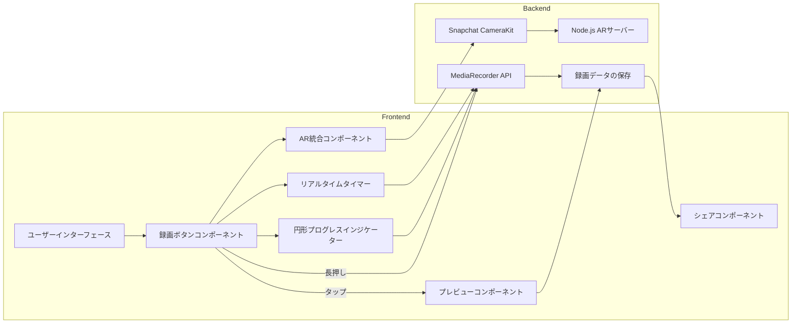
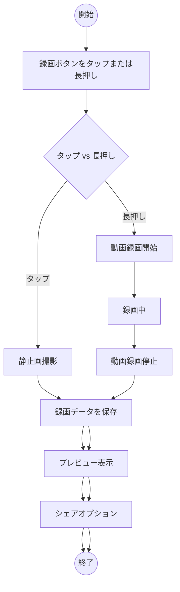
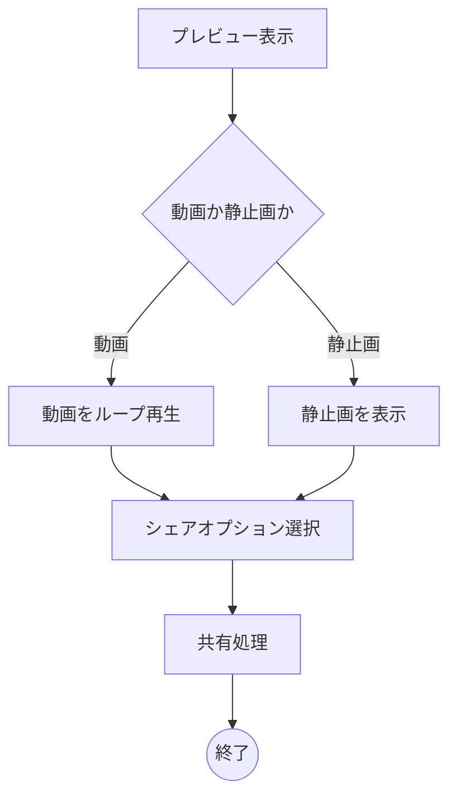
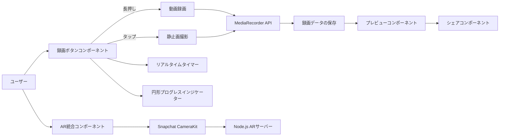
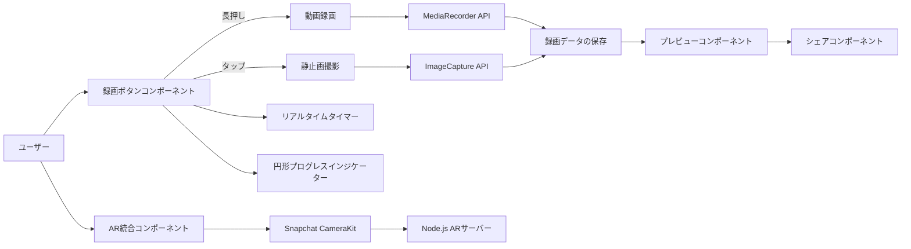

# arcapture_nodejs_202411
Node.jsでAR Webアプリのキャプチャ実装の作業用リポジトリ

追加機能を含めた**録画ボタン付き動画撮影機能**の設計を以下に示します。この設計には、**タップで静止画の撮影、長押しで動画の録画、プレビュー機能（動画はループ再生）、シェア機能**が含まれます。また、既存の**Node.jsベースのAR機能**と**SnapchatのCameraKit**の統合についても説明します。

このドキュメントは、**Markdown**形式で記述しており、**GitHubのREADME.md**に適しています。**Mermaid**を使用して図を作成し、視覚的に設計を可視化します。

## 1. プロジェクト概要

ユーザーが**タップで静止画を撮影**し、**長押しで動画を録画**できる機能を提供します。録画中はリアルタイムで経過時間を表示し、**円形プログレスインジケーター**で録画状況を視覚的に示します。撮影後は**プレビュー画面**で静止画や動画を確認でき、**シェア機能**を通じて他のユーザーと共有できます。さらに、既存の**Node.jsベースのAR機能**を**SnapchatのCameraKit**と統合します。

---

## 2. 設計プロセスの概要

### ゴールの定義

- **目的**: ユーザーがアプリ内で静止画と動画の撮影を直感的に行え、撮影後のプレビューおよびシェアが可能な機能を提供する。
- **主な機能**:
  - タップで静止画撮影
  - 長押しで動画録画
  - 録画中のリアルタイムタイマー表示
  - 録画中の円形プログレスインジケーター表示
  - 撮影後のプレビュー（動画はループ再生）
  - シェア機能
  - AR機能の統合（CameraKit使用）

### 要件定義

- **機能要件**:
  - タップ操作で静止画を撮影
  - 長押し操作で動画を録画
  - 録画中は録画ボタンの色を赤に変更
  - 録画中に経過時間をリアルタイムで表示
  - 録画中に円形プログレスインジケーターを表示し、録画時間と同期
  - 撮影後にプレビュー画面を表示（動画はループ再生）
  - プレビュー画面からシェアオプションを提供
  - AR機能を統合し、ARフィルターを適用
  - 録画データの保存と管理

- **非機能要件**:
  - ユーザーインターフェースは直感的で使いやすい
  - レスポンシブデザインを採用し、様々なデバイスでの表示に対応
  - パフォーマンスを最適化し、スムーズな操作感を提供
  - セキュリティとプライバシーを確保（録画データの適切な管理）

### 技術選定

- **フロントエンド**:
  - HTML, CSS, JavaScript
  - フレームワーク（必要に応じて）: React, Vue.js など
- **バックエンド**:
  - Node.js（既存のAR機能との統合）
- **ライブラリ**:
  - プログレスインジケーター: [ProgressBar.js](https://kimmobrunfeldt.github.io/progressbar.js/), [Mermaid](https://mermaid-js.github.io/)
  - 録画処理: [MediaRecorder API](https://developer.mozilla.org/ja/docs/Web/API/MediaRecorder)
  - AR統合: [Snapchat CameraKit](https://developers.snap.com/docs/camerakit/)
- **ドキュメンテーション**:
  - Markdown（GitHub README.md）
  - 図表作成: [Mermaid](https://mermaid-js.github.io/)（Markdown内での図表作成に利用）

---

## 3. システムアーキテクチャ

### 全体図

以下の図は、システム全体のアーキテクチャを示しています。新たに追加された機能を含めています。



### 拡張されたアーキテクチャ図



---

## 4. コンポーネント設計

### 録画ボタンコンポーネント

- **機能**:
  - **タップ操作**で静止画を撮影
  - **長押し操作**で動画を録画
  - 録画中はボタンの色を赤に変更
  - 録画中はプログレスインジケーターとタイマーを表示
- **状態管理**:
  - `isRecording`: 録画中かどうかのフラグ
  - `startTime`: 録画開始時刻
  - `elapsedTime`: 経過時間
- **イベントハンドリング**:
  - `click`（タップ）: 静止画撮影
  - `mousedown` / `touchstart`（長押し開始）: 動画録画開始
  - `mouseup` / `touchend`（長押し終了）: 動画録画停止

### リアルタイムタイマー

- **機能**:
  - 録画開始からの経過時間を表示
- **更新方法**:
  - `setInterval`を使用して1秒ごとに更新

### 円形プログレスインジケーター

- **機能**:
  - 録画時間に応じて進捗を表示
- **実装方法**:
  - SVGとCSSアニメーションを使用
  - `stroke-dasharray`と`stroke-dashoffset`を調整
- **同期方法**:
  - タイマーと連動してプログレスを更新

### プレビューコンポーネント

- **機能**:
  - 撮影後に静止画または動画をプレビュー表示
  - 動画はループ再生
  - プレビューからシェアオプションへ移行
- **実装方法**:
  - 静止画: ``タグを使用
  - 動画: `<video>`タグを使用し、`loop`属性を設定

### シェアコンポーネント

- **機能**:
  - 撮影した静止画や動画を他のアプリやプラットフォームと共有
- **実装方法**:
  - Web Share APIを使用（ブラウザ対応を確認）
  - カスタムシェアダイアログを実装

### AR統合コンポーネント

- **機能**:
  - ARフィルターやエフェクトを適用
- **実装方法**:
  - **Snapchat CameraKit**を使用してAR機能を統合
  - **Node.js ARサーバー**と連携し、リアルタイムでAR効果を適用

---

## 5. フローチャート

### 録画操作のフロー



### プレビューとシェアのフロー



---

## 6. データフロー図



---

## 7. 実装に必要な要素と処理

### 必要な要素

- **UIコンポーネント**:
  - 録画ボタン
  - タイマー表示
  - 円形プログレスインジケーター
  - プレビュー画面
  - シェアボタン
  - ARフィルター表示
- **機能コンポーネント**:
  - 録画制御ロジック
  - タイマー更新ロジック
  - プログレスインジケーター更新ロジック
  - プレビュー表示ロジック
  - シェア機能ロジック
  - AR統合ロジック

### 必要な処理

- **録画ボタンの操作検出**:
  - タップと長押しの区別
- **録画開始・停止の制御**:
  - タップで静止画
  - 長押しで動画
- **UIの更新**:
  - 録画中はボタン色を赤に変更
  - プログレスインジケーターとタイマーを表示・更新
- **プレビュー画面の表示**:
  - 撮影後に静止画または動画をプレビュー
  - 動画はループ再生
- **シェア機能の実装**:
  - プレビュー画面から共有オプションを提供
- **AR機能の統合**:
  - CameraKitを使用してARフィルターを適用
  - Node.jsサーバーと連携

### 使用する関数やライブラリ

- **JavaScript関数**:
  - `setInterval` / `clearInterval`（タイマー制御）
  - イベントリスナー（`click`, `mousedown`, `mouseup`, `touchstart`, `touchend`）
  - MediaRecorder API（録画処理）
  - Web Share API（シェア機能）
- **ライブラリ**:
  - [ProgressBar.js](https://kimmobrunfeldt.github.io/progressbar.js/) または [Mermaid](https://mermaid-js.github.io/)（プログレスインジケーターの可視化）
  - [Snapchat CameraKit](https://developers.snap.com/docs/camerakit/)（AR機能の統合）
  - [Node.js](https://nodejs.org/)（バックエンド処理）

---

## 8. 実装例

以下に、設計を基にした簡単な実装例を示します。これを基に機能を拡張していくことができます。

### HTML構造

```html
<!DOCTYPE html>
<html lang="ja">
<head>
  <meta charset="UTF-8">
  <title>録画ボタン付き動画撮影機能</title>
  <link rel="stylesheet" href="styles.css">
</head>
<body>
  <div class="record-container">
    <svg class="progress-ring" width="120" height="120">
      <circle
        class="progress-ring__circle"
        stroke="red"
        stroke-width="4"
        fill="transparent"
        r="54"
        cx="60"
        cy="60"
      />
    </svg>
    <button class="record-btn" id="recordButton"></button>
    <div class="timer" id="timer">00:00</div>
  </div>

  <!-- プレビュー画面 -->
  <div class="preview-container" id="previewContainer" style="display: none;">
    <div class="preview-content" id="previewContent"></div>
    <button class="share-btn" id="shareButton">シェア</button>
    <button class="close-btn" id="closePreview">閉じる</button>
  </div>

  <!-- ARフィルター表示 -->
  <div id="arContainer"></div>

  <script src="script.js"></script>
</body>
</html>
```

### CSSスタイル

```css
/* styles.css */

body {
  display: flex;
  justify-content: center;
  align-items: center;
  height: 100vh;
  background-color: #f0f0f0;
}

.record-container {
  position: relative;
  width: 120px;
  height: 120px;
}

.progress-ring {
  position: absolute;
  top: 0;
  left: 0;
  transform: rotate(-90deg);
}

.progress-ring__circle {
  stroke-dasharray: 339.292; /* 2 * π * r (r=54) */
  stroke-dashoffset: 339.292;
  transition: stroke-dashoffset 1s linear;
}

.record-btn {
  position: absolute;
  top: 50%;
  left: 50%;
  width: 80px;
  height: 80px;
  border-radius: 50%;
  background-color: grey;
  border: none;
  transform: translate(-50%, -50%);
  cursor: pointer;
}

.record-btn.recording {
  background-color: red;
}

.timer {
  position: absolute;
  bottom: -40px;
  left: 50%;
  transform: translateX(-50%);
  font-size: 18px;
  color: #333;
}

.preview-container {
  position: fixed;
  top: 0;
  left: 0;
  width: 100%;
  height: 100%;
  background-color: rgba(0, 0, 0, 0.8);
  display: flex;
  flex-direction: column;
  justify-content: center;
  align-items: center;
}

.preview-content {
  max-width: 80%;
  max-height: 80%;
}

.share-btn, .close-btn {
  margin: 10px;
  padding: 10px 20px;
  font-size: 16px;
  cursor: pointer;
}

#arContainer {
  position: absolute;
  top: 0;
  left: 0;
  width: 100%;
  height: 100%;
  pointer-events: none;
}
```

### JavaScriptロジック

```javascript
// script.js

const recordButton = document.getElementById('recordButton');
const progressCircle = document.querySelector('.progress-ring__circle');
const timerElement = document.getElementById('timer');
const previewContainer = document.getElementById('previewContainer');
const previewContent = document.getElementById('previewContent');
const shareButton = document.getElementById('shareButton');
const closePreview = document.getElementById('closePreview');

let isRecording = false;
let isLongPress = false;
let startTime = null;
let timerInterval = null;
let mediaRecorder;
let recordedChunks = [];

// 計算用
const radius = progressCircle.r.baseVal.value;
const circumference = 2 * Math.PI * radius;
progressCircle.style.strokeDasharray = `${circumference} ${circumference}`;
progressCircle.style.strokeDashoffset = circumference;

// タイマーとプログレスの更新
function setProgress(percent) {
  const offset = circumference - (percent / 100) * circumference;
  progressCircle.style.strokeDashoffset = offset;
}

function updateTimer() {
  const elapsed = Math.floor((Date.now() - startTime) / 1000);
  const minutes = String(Math.floor(elapsed / 60)).padStart(2, '0');
  const seconds = String(elapsed % 60).padStart(2, '0');
  timerElement.textContent = `${minutes}:${seconds}`;
  setProgress((elapsed % 100)); // 進捗を0-100%でループさせる例
}

// 録画開始処理
function startRecording() {
  if (isRecording) return;
  isRecording = true;
  isLongPress = true;
  recordButton.classList.add('recording');
  startTime = Date.now();
  timerInterval = setInterval(updateTimer, 1000);
  setProgress(0);

  // MediaRecorderの設定
  navigator.mediaDevices.getUserMedia({ video: true, audio: true })
    .then(stream => {
      mediaRecorder = new MediaRecorder(stream);
      mediaRecorder.start();
      mediaRecorder.ondataavailable = event => {
        if (event.data.size > 0) {
          recordedChunks.push(event.data);
        }
      };
      mediaRecorder.onstop = () => {
        const blob = new Blob(recordedChunks, { type: 'video/webm' });
        const url = URL.createObjectURL(blob);
        showPreview('video', url);
        recordedChunks = [];
      };
    })
    .catch(error => {
      console.error('メディアの取得に失敗しました:', error);
      stopRecording();
    });

  // プログレスインジケーターのアニメーション開始
  progressCircle.style.transition = 'stroke-dashoffset 1s linear';
}

// 録画停止処理
function stopRecording() {
  if (!isRecording) return;
  isRecording = false;
  isLongPress = false;
  recordButton.classList.remove('recording');
  clearInterval(timerInterval);
  timerElement.textContent = '00:00';
  progressCircle.style.strokeDashoffset = circumference;

  if (mediaRecorder && mediaRecorder.state !== 'inactive') {
    mediaRecorder.stop();
  }
}

// 静止画撮影処理
function capturePhoto() {
  navigator.mediaDevices.getUserMedia({ video: true })
    .then(stream => {
      const videoTrack = stream.getVideoTracks()[0];
      const imageCapture = new ImageCapture(videoTrack);
      return imageCapture.takePhoto();
    })
    .then(blob => {
      const url = URL.createObjectURL(blob);
      showPreview('image', url);
    })
    .catch(error => {
      console.error('静止画の取得に失敗しました:', error);
    });
}

// プレビュー表示処理
function showPreview(type, url) {
  previewContainer.style.display = 'flex';
  previewContent.innerHTML = '';
  if (type === 'video') {
    const video = document.createElement('video');
    video.src = url;
    video.controls = true;
    video.loop = true;
    video.autoplay = true;
    previewContent.appendChild(video);
  } else if (type === 'image') {
    const img = document.createElement('img');
    img.src = url;
    img.alt = 'Captured Image';
    previewContent.appendChild(img);
  }
}

// シェア処理
function shareMedia() {
  const content = previewContent.firstChild;
  if (!content) return;

  let file;
  if (content.tagName === 'VIDEO') {
    file = new File([recordedChunks], 'recorded_video.webm', { type: 'video/webm' });
  } else if (content.tagName === 'IMG') {
    // 画像の場合はBlobからFileを作成
    fetch(content.src)
      .then(res => res.blob())
      .then(blob => {
        const imgFile = new File([blob], 'captured_image.png', { type: 'image/png' });
        shareFile(imgFile);
      });
    return;
  }

  shareFile(file);
}

function shareFile(file) {
  if (navigator.share) {
    navigator.share({
      files: [file],
      title: '共有メディア',
      text: '撮影したメディアを共有します。',
    })
    .then(() => console.log('共有成功'))
    .catch(error => console.error('共有失敗:', error));
  } else {
    alert('シェア機能がサポートされていません。');
  }
}

// プレビュー閉じる処理
function closePreviewScreen() {
  previewContainer.style.display = 'none';
  previewContent.innerHTML = '';
}

// イベントリスナーの設定
recordButton.addEventListener('click', (e) => {
  if (isLongPress) return; // 長押し中はタップを無視
  capturePhoto();
});

let pressTimer;

recordButton.addEventListener('mousedown', () => {
  pressTimer = setTimeout(() => {
    startRecording();
  }, 500); // 500ms以上押し続けたら長押しと判定
});

recordButton.addEventListener('mouseup', () => {
  clearTimeout(pressTimer);
  if (isLongPress) {
    stopRecording();
  }
});

recordButton.addEventListener('mouseleave', () => {
  clearTimeout(pressTimer);
  if (isLongPress) {
    stopRecording();
  }
});

// タッチデバイス対応
recordButton.addEventListener('touchstart', (e) => {
  e.preventDefault();
  pressTimer = setTimeout(() => {
    startRecording();
  }, 500);
});

recordButton.addEventListener('touchend', (e) => {
  clearTimeout(pressTimer);
  if (isLongPress) {
    stopRecording();
  } else {
    capturePhoto();
  }
});

shareButton.addEventListener('click', shareMedia);
closePreview.addEventListener('click', closePreviewScreen);
```

### 追加: AR統合コンポーネントのJavaScript

```javascript
// AR統合コンポーネントの設定
// この部分はSnapchat CameraKitの設定に依存します。
// 公式ドキュメントを参照してください。

// 例: CameraKitの初期化
import { CameraKit } from 'camerakit-js';

const cameraKit = new CameraKit({
  container: '#arContainer',
  // その他の設定オプション
});

// ARフィルターの適用
function applyARFilter(filterName) {
  cameraKit.applyFilter(filterName);
}

// Node.jsサーバーとの連携
// WebSocketやREST APIを使用して、リアルタイムでARデータをやり取り
const socket = new WebSocket('ws://your-nodejs-server.com');

socket.onopen = () => {
  console.log('Connected to AR server');
};

socket.onmessage = (event) => {
  const data = JSON.parse(event.data);
  // ARデータの処理
  applyARFilter(data.filterName);
};
```

---

## 9. 設計ドキュメントのまとめ例

以下は、GitHubのREADME.mdにまとめる際の一例です。

```markdown
# 録画ボタン付き動画撮影機能の設計

## 目次
- [プロジェクト概要](#プロジェクト概要)
- [設計プロセスの概要](#設計プロセスの概要)
  - [ゴールの定義](#ゴールの定義)
  - [要件定義](#要件定義)
  - [技術選定](#技術選定)
- [システムアーキテクチャ](#システムアーキテクチャ)
  - [全体図](#全体図)
  - [拡張されたアーキテクチャ図](#拡張されたアーキテクチャ図)
- [コンポーネント設計](#コンポーネント設計)
  - [録画ボタンコンポーネント](#録画ボタンコンポーネント)
  - [リアルタイムタイマー](#リアルタイムタイマー)
  - [円形プログレスインジケーター](#円形プログレスインジケーター)
  - [プレビューコンポーネント](#プレビューコンポーネント)
  - [シェアコンポーネント](#シェアコンポーネント)
  - [AR統合コンポーネント](#ar統合コンポーネント)
- [フローチャート](#フローチャート)
  - [録画操作のフロー](#録画操作のフロー)
  - [プレビューとシェアのフロー](#プレビューとシェアのフロー)
- [データフロー図](#データフロー図)
- [実装に必要な要素と処理](#実装に必要な要素と処理)
  - [必要な要素](#必要な要素)
  - [必要な処理](#必要な処理)
  - [使用する関数やライブラリ](#使用する関数やライブラリ)
- [Markdownでの可視化方法](#markdownでの可視化方法)
- [実装例](#実装例)
  - [HTML構造](#html構造)
  - [CSSスタイル](#cssスタイル)
  - [JavaScriptロジック](#javascriptロジック)
- [まとめ](#まとめ)

## プロジェクト概要

ユーザーが**タップで静止画を撮影**し、**長押しで動画を録画**できる機能を提供します。録画中はリアルタイムで経過時間を表示し、**円形プログレスインジケーター**で録画状況を視覚的に示します。撮影後は**プレビュー画面**で静止画や動画を確認でき、**シェア機能**を通じて他のユーザーと共有できます。さらに、既存の**Node.jsベースのAR機能**を**SnapchatのCameraKit**と統合します。

## 設計プロセスの概要

### ゴールの定義

- **目的**: ユーザーがアプリ内で静止画と動画の撮影を直感的に行え、撮影後のプレビューおよびシェアが可能な機能を提供する。
- **主な機能**:
  - タップで静止画撮影
  - 長押しで動画録画
  - 録画中のリアルタイマー表示
  - 録画中の円形プログレスインジケーター表示
  - 撮影後のプレビュー（動画はループ再生）
  - シェア機能
  - AR機能の統合（CameraKit使用）

### 要件定義

- **機能要件**:
  - タップ操作で静止画を撮影
  - 長押し操作で動画を録画
  - 録画中は録画ボタンの色を赤に変更
  - 録画中に経過時間をリアルタイムで表示
  - 録画中に円形プログレスインジケーターを表示し、録画時間と同期させる
  - 撮影後にプレビュー画面を表示（動画はループ再生）
  - プレビュー画面からシェアオプションを提供
  - 録画データを保存し、ユーザーがアクセスできるようにする
  - AR機能を統合し、ARフィルターを適用
  - 録画データの保存と管理

- **非機能要件**:
  - ユーザーインターフェースは直感的で使いやすい
  - レスポンシブデザインを採用し、様々なデバイスでの表示に対応
  - パフォーマンスを最適化し、スムーズな操作感を提供
  - セキュリティとプライバシーを確保（録画データの適切な管理）

### 技術選定

- **フロントエンド**:
  - HTML, CSS, JavaScript
  - フレームワーク（必要に応じて）: React, Vue.js など
- **バックエンド**:
  - Node.js（既存のAR機能との統合）
- **ライブラリ**:
  - プログレスインジケーター: [ProgressBar.js](https://kimmobrunfeldt.github.io/progressbar.js/), [Mermaid](https://mermaid-js.github.io/)
  - 録画処理: [MediaRecorder API](https://developer.mozilla.org/ja/docs/Web/API/MediaRecorder)
  - AR統合: [Snapchat CameraKit](https://developers.snap.com/docs/camerakit/)
- **ドキュメンテーション**:
  - Markdown（GitHub README.md）
  - 図表作成: [Mermaid](https://mermaid-js.github.io/)（Markdown内での図表作成に利用）

## システムアーキテクチャ

### 全体図


### 拡張されたアーキテクチャ図


## コンポーネント設計

### 録画ボタンコンポーネント

- **機能**:
  - **タップ操作**で静止画を撮影
  - **長押し操作**で動画を録画
  - 録画中はボタンの色を赤に変更
  - 録画中はプログレスインジケーターとタイマーを表示
- **状態管理**:
  - `isRecording`: 録画中かどうかのフラグ
  - `isLongPress`: 長押し操作中かどうかのフラグ
  - `startTime`: 録画開始時刻
  - `elapsedTime`: 経過時間
- **イベントハンドリング**:
  - `click`（タップ）: 静止画撮影
  - `mousedown` / `touchstart`（長押し開始）: 動画録画開始
  - `mouseup` / `touchend`（長押し終了）: 動画録画停止

### リアルタイムタイマー

- **機能**:
  - 録画開始からの経過時間を表示
- **更新方法**:
  - `setInterval`を使用して1秒ごとに更新

### 円形プログレスインジケーター

- **機能**:
  - 録画時間に応じて進捗を表示
- **実装方法**:
  - SVGとCSSアニメーションを使用
  - `stroke-dasharray`と`stroke-dashoffset`を調整
- **同期方法**:
  - タイマーと連動してプログレスを更新

### プレビューコンポーネント

- **機能**:
  - 撮影後に静止画または動画をプレビュー表示
  - 動画はループ再生
  - プレビューからシェアオプションへ移行
- **実装方法**:
  - 静止画: ``タグを使用
  - 動画: `<video>`タグを使用し、`loop`属性を設定
- **ユーザーインターフェース**:
  - プレビュー画面はオーバーレイとして表示
  - シェアボタンと閉じるボタンを配置

### シェアコンポーネント

- **機能**:
  - 撮影した静止画や動画を他のアプリやプラットフォームと共有
- **実装方法**:
  - Web Share APIを使用（ブラウザ対応を確認）
  - カスタムシェアダイアログを実装
- **ユーザーインターフェース**:
  - シェアボタンをクリックすると共有オプションを表示

### AR統合コンポーネント

- **機能**:
  - ARフィルターやエフェクトを適用
- **実装方法**:
  - **Snapchat CameraKit**を使用してAR機能を統合
  - **Node.js ARサーバー**と連携し、リアルタイムでAR効果を適用
- **通信方法**:
  - WebSocketやREST APIを使用して、リアルタイムでARデータをやり取り

---

## 5. フローチャート

### 録画操作のフロー


### プレビューとシェアのフロー


---

## 6. データフロー図



---

## 7. 実装に必要な要素と処理

### 必要な要素

- **UIコンポーネント**:
  - 録画ボタン
  - タイマー表示
  - 円形プログレスインジケーター
  - プレビュー画面
  - シェアボタン
  - ARフィルター表示
- **機能コンポーネント**:
  - 録画制御ロジック
  - タイマー更新ロジック
  - プログレスインジケーター更新ロジック
  - プレビュー表示ロジック
  - シェア機能ロジック
  - AR統合ロジック

### 必要な処理

- **録画ボタンの操作検出**:
  - タップと長押しの区別
- **録画開始・停止の制御**:
  - タップで静止画
  - 長押しで動画
- **UIの更新**:
  - 録画中はボタン色を赤に変更
  - プログレスインジケーターとタイマーを表示・更新
- **プレビュー画面の表示**:
  - 撮影後に静止画または動画をプレビュー
  - 動画はループ再生
- **シェア機能の実装**:
  - プレビュー画面から共有オプションを提供
- **AR機能の統合**:
  - CameraKitを使用してARフィルターを適用
  - Node.jsサーバーと連携

### 使用する関数やライブラリ

- **JavaScript関数**:
  - `setInterval` / `clearInterval`（タイマー制御）
  - イベントリスナー（`click`, `mousedown`, `mouseup`, `touchstart`, `touchend`）
  - MediaRecorder API（録画処理）
  - ImageCapture API（静止画撮影）
  - Web Share API（シェア機能）
- **ライブラリ**:
  - [ProgressBar.js](https://kimmobrunfeldt.github.io/progressbar.js/) または [Mermaid](https://mermaid-js.github.io/)（プログレスインジケーターの可視化）
  - [Snapchat CameraKit](https://developers.snap.com/docs/camerakit/)（AR機能の統合）
  - [Node.js](https://nodejs.org/)（バックエンド処理）

---

## 8. Markdownでの可視化方法

GitHubのREADME.mdなどで設計を共有する際、以下のようにMarkdownとMermaidを組み合わせて図を作成できます。

### システムアーキテクチャの図

```markdown
## システムアーキテクチャ


```

### フローチャートの図

```markdown
## 録画操作のフロー


## 9. 実装例

以下に、設計を基にした簡単な実装例を示します。これを基に機能を拡張していくことができます。

### HTML構造

```html
<!DOCTYPE html>
<html lang="ja">
<head>
  <meta charset="UTF-8">
  <title>録画ボタン付き動画撮影機能</title>
  <link rel="stylesheet" href="styles.css">
</head>
<body>
  <div class="record-container">
    <svg class="progress-ring" width="120" height="120">
      <circle
        class="progress-ring__circle"
        stroke="red"
        stroke-width="4"
        fill="transparent"
        r="54"
        cx="60"
        cy="60"
      />
    </svg>
    <button class="record-btn" id="recordButton"></button>
    <div class="timer" id="timer">00:00</div>
  </div>

  <!-- プレビュー画面 -->
  <div class="preview-container" id="previewContainer" style="display: none;">
    <div class="preview-content" id="previewContent"></div>
    <button class="share-btn" id="shareButton">シェア</button>
    <button class="close-btn" id="closePreview">閉じる</button>
  </div>

  <!-- ARフィルター表示 -->
  <div id="arContainer"></div>

  <script src="script.js"></script>
</body>
</html>
```

### CSSスタイル

```css
/* styles.css */

body {
  display: flex;
  justify-content: center;
  align-items: center;
  height: 100vh;
  background-color: #f0f0f0;
}

.record-container {
  position: relative;
  width: 120px;
  height: 120px;
}

.progress-ring {
  position: absolute;
  top: 0;
  left: 0;
  transform: rotate(-90deg);
}

.progress-ring__circle {
  stroke-dasharray: 339.292; /* 2 * π * r (r=54) */
  stroke-dashoffset: 339.292;
  transition: stroke-dashoffset 1s linear;
}

.record-btn {
  position: absolute;
  top: 50%;
  left: 50%;
  width: 80px;
  height: 80px;
  border-radius: 50%;
  background-color: grey;
  border: none;
  transform: translate(-50%, -50%);
  cursor: pointer;
}

.record-btn.recording {
  background-color: red;
}

.timer {
  position: absolute;
  bottom: -40px;
  left: 50%;
  transform: translateX(-50%);
  font-size: 18px;
  color: #333;
}

.preview-container {
  position: fixed;
  top: 0;
  left: 0;
  width: 100%;
  height: 100%;
  background-color: rgba(0, 0, 0, 0.8);
  display: flex;
  flex-direction: column;
  justify-content: center;
  align-items: center;
}

.preview-content {
  max-width: 80%;
  max-height: 80%;
}

.share-btn, .close-btn {
  margin: 10px;
  padding: 10px 20px;
  font-size: 16px;
  cursor: pointer;
}

#arContainer {
  position: absolute;
  top: 0;
  left: 0;
  width: 100%;
  height: 100%;
  pointer-events: none;
}
```

### JavaScriptロジック

```javascript
// script.js

const recordButton = document.getElementById('recordButton');
const progressCircle = document.querySelector('.progress-ring__circle');
const timerElement = document.getElementById('timer');
const previewContainer = document.getElementById('previewContainer');
const previewContent = document.getElementById('previewContent');
const shareButton = document.getElementById('shareButton');
const closePreview = document.getElementById('closePreview');

let isRecording = false;
let isLongPress = false;
let startTime = null;
let timerInterval = null;
let mediaRecorder;
let recordedChunks = [];

// 計算用
const radius = progressCircle.r.baseVal.value;
const circumference = 2 * Math.PI * radius;
progressCircle.style.strokeDasharray = `${circumference} ${circumference}`;
progressCircle.style.strokeDashoffset = circumference;

// タイマーとプログレスの更新
function setProgress(percent) {
  const offset = circumference - (percent / 100) * circumference;
  progressCircle.style.strokeDashoffset = offset;
}

function updateTimer() {
  const elapsed = Math.floor((Date.now() - startTime) / 1000);
  const minutes = String(Math.floor(elapsed / 60)).padStart(2, '0');
  const seconds = String(elapsed % 60).padStart(2, '0');
  timerElement.textContent = `${minutes}:${seconds}`;
  setProgress((elapsed % 100)); // 進捗を0-100%でループさせる例
}

// 録画開始処理
function startRecording() {
  if (isRecording) return;
  isRecording = true;
  isLongPress = true;
  recordButton.classList.add('recording');
  startTime = Date.now();
  timerInterval = setInterval(updateTimer, 1000);
  setProgress(0);

  // MediaRecorderの設定
  navigator.mediaDevices.getUserMedia({ video: true, audio: true })
    .then(stream => {
      mediaRecorder = new MediaRecorder(stream);
      mediaRecorder.start();
      mediaRecorder.ondataavailable = event => {
        if (event.data.size > 0) {
          recordedChunks.push(event.data);
        }
      };
      mediaRecorder.onstop = () => {
        const blob = new Blob(recordedChunks, { type: 'video/webm' });
        const url = URL.createObjectURL(blob);
        showPreview('video', url);
        recordedChunks = [];
      };
    })
    .catch(error => {
      console.error('メディアの取得に失敗しました:', error);
      stopRecording();
    });

  // プログレスインジケーターのアニメーション開始
  progressCircle.style.transition = 'stroke-dashoffset 1s linear';
}

// 録画停止処理
function stopRecording() {
  if (!isRecording) return;
  isRecording = false;
  isLongPress = false;
  recordButton.classList.remove('recording');
  clearInterval(timerInterval);
  timerElement.textContent = '00:00';
  progressCircle.style.strokeDashoffset = circumference;

  if (mediaRecorder && mediaRecorder.state !== 'inactive') {
    mediaRecorder.stop();
  }
}

// 静止画撮影処理
function capturePhoto() {
  navigator.mediaDevices.getUserMedia({ video: true })
    .then(stream => {
      const videoTrack = stream.getVideoTracks()[0];
      const imageCapture = new ImageCapture(videoTrack);
      return imageCapture.takePhoto();
    })
    .then(blob => {
      const url = URL.createObjectURL(blob);
      showPreview('image', url);
    })
    .catch(error => {
      console.error('静止画の取得に失敗しました:', error);
    });
}

// プレビュー表示処理
function showPreview(type, url) {
  previewContainer.style.display = 'flex';
  previewContent.innerHTML = '';
  if (type === 'video') {
    const video = document.createElement('video');
    video.src = url;
    video.controls = true;
    video.loop = true;
    video.autoplay = true;
    previewContent.appendChild(video);
  } else if (type === 'image') {
    const img = document.createElement('img');
    img.src = url;
    img.alt = 'Captured Image';
    previewContent.appendChild(img);
  }
}

// シェア処理
function shareMedia() {
  const content = previewContent.firstChild;
  if (!content) return;

  let file;
  if (content.tagName === 'VIDEO') {
    file = new File([recordedChunks], 'recorded_video.webm', { type: 'video/webm' });
  } else if (content.tagName === 'IMG') {
    // 画像の場合はBlobからFileを作成
    fetch(content.src)
      .then(res => res.blob())
      .then(blob => {
        const imgFile = new File([blob], 'captured_image.png', { type: 'image/png' });
        shareFile(imgFile);
      });
    return;
  }

  shareFile(file);
}

function shareFile(file) {
  if (navigator.share) {
    navigator.share({
      files: [file],
      title: '共有メディア',
      text: '撮影したメディアを共有します。',
    })
    .then(() => console.log('共有成功'))
    .catch(error => console.error('共有失敗:', error));
  } else {
    alert('シェア機能がサポートされていません。');
  }
}

// プレビュー閉じる処理
function closePreviewScreen() {
  previewContainer.style.display = 'none';
  previewContent.innerHTML = '';
}

// イベントリスナーの設定
recordButton.addEventListener('click', (e) => {
  if (isLongPress) return; // 長押し中はタップを無視
  capturePhoto();
});

let pressTimer;

recordButton.addEventListener('mousedown', () => {
  pressTimer = setTimeout(() => {
    startRecording();
  }, 500); // 500ms以上押し続けたら長押しと判定
});

recordButton.addEventListener('mouseup', () => {
  clearTimeout(pressTimer);
  if (isLongPress) {
    stopRecording();
  }
});

recordButton.addEventListener('mouseleave', () => {
  clearTimeout(pressTimer);
  if (isLongPress) {
    stopRecording();
  }
});

// タッチデバイス対応
recordButton.addEventListener('touchstart', (e) => {
  e.preventDefault();
  pressTimer = setTimeout(() => {
    startRecording();
  }, 500);
});

recordButton.addEventListener('touchend', (e) => {
  clearTimeout(pressTimer);
  if (isLongPress) {
    stopRecording();
  } else {
    capturePhoto();
  }
});

shareButton.addEventListener('click', shareMedia);
closePreview.addEventListener('click', closePreviewScreen);

// AR統合コンポーネントの設定
// この部分はSnapchat CameraKitの設定に依存します。
// 公式ドキュメントを参照してください。

// 例: CameraKitの初期化
// import { CameraKit } from 'camerakit-js';

// const cameraKit = new CameraKit({
//   container: '#arContainer',
//   // その他の設定オプション
// });

// // ARフィルターの適用
// function applyARFilter(filterName) {
//   cameraKit.applyFilter(filterName);
// }

// // Node.jsサーバーとの連携
// const socket = new WebSocket('ws://your-nodejs-server.com');

// socket.onopen = () => {
//   console.log('Connected to AR server');
// };

// socket.onmessage = (event) => {
//   const data = JSON.parse(event.data);
//   // ARデータの処理
//   applyARFilter(data.filterName);
// };
```

---

## 11. まとめ

設計段階で以下のポイントを押さえることで、効率的かつ効果的に機能を実装できます。

1. **ゴールと要件の明確化**: 何を達成したいのか、どのような機能が必要かを明確にする。
2. **システムアーキテクチャの設計**: 各コンポーネントがどのように連携するかを視覚的に把握する。
3. **コンポーネント設計**: 各UIコンポーネントや機能コンポーネントの詳細を設計する。
4. **フローチャートとデータフロー図の活用**: プロセスやデータの流れを明確にする。
5. **図表の活用**: Mermaidを用いて視覚的に設計内容を表現する。
6. **ドキュメンテーション**: MarkdownやMermaidを活用して、設計内容を分かりやすくドキュメント化する。
7. **実装例の提供**: 設計に基づいたコード例を示し、実装の参考にする。
8. **継続的なレビューと改善**: 実装を進める中で設計を見直し、必要に応じて改善を行う。

このアプローチを採用することで、**静止画と動画の撮影機能**に加え、**プレビューとシェア機能**、**AR統合機能**を含む**複雑なアプリケーション**でも、体系的に設計し、実装に移行することができます。GitHubのREADME.mdや他のドキュメントにまとめる際も、同様の手法を用いることで、他の開発者やチームメンバーと効果的に情報を共有できます。

ぜひ、上記の例を参考にして、自分自身のプロジェクトに合わせた設計ドキュメントを作成してください。
# mywebrec
