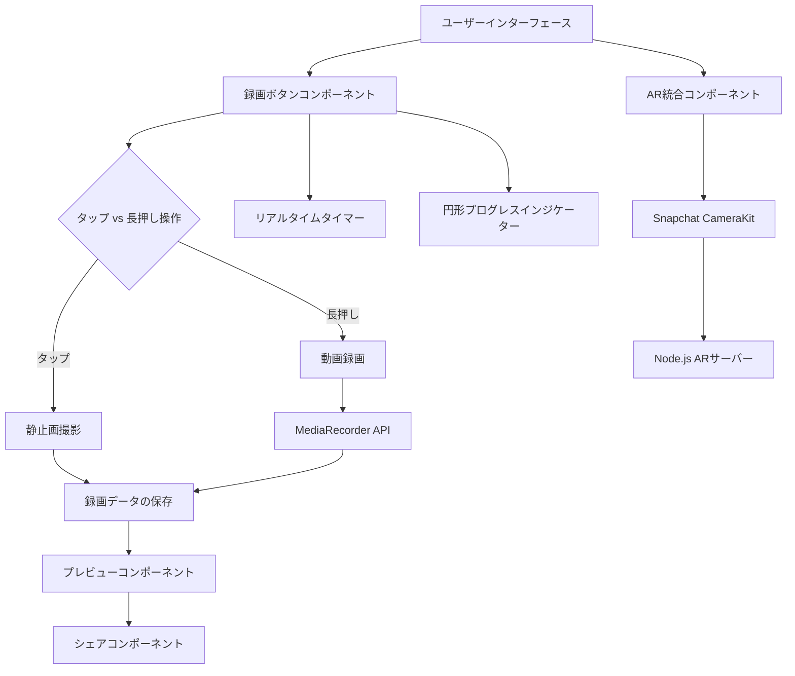

# arcapture_nodejs_202411
Node.jsでAR Webアプリのキャプチャ実装の作業用リポジトリ

追加機能を含めた**録画ボタン付き動画撮影機能**の設計を以下に示します。この設計には、**タップで静止画の撮影、長押しで動画の録画、プレビュー機能（動画はループ再生）、シェア機能**が含まれます。また、既存の**Node.jsベースのAR機能**と**SnapchatのCameraKit**の統合についても説明します。

このドキュメントは、**Markdown**形式で記述しており、**GitHubのREADME.md**に適しています。**Mermaid**を使用して図を作成し、視覚的に設計を可視化します。

## 1. プロジェクト概要

ユーザーが**タップで静止画を撮影**し、**長押しで動画を録画**できる機能を提供します。録画中はリアルタイムで経過時間を表示し、**円形プログレスインジケーター**で録画状況を視覚的に示します。撮影後は**プレビュー画面**で静止画や動画を確認でき、**シェア機能**を通じて他のユーザーと共有できます。さらに、既存の**Node.jsベースのAR機能**を**SnapchatのCameraKit**と統合します。

### 技術選定

- **フロントエンド**:
  - HTML, CSS, JavaScript
  - フレームワーク（必要に応じて）: React, Vue.js など
- **バックエンド**:
  - Node.js（既存のAR機能との統合）
- **ライブラリ**:
  - プログレスインジケーター: [ProgressBar.js](https://kimmobrunfeldt.github.io/progressbar.js/), [Mermaid](https://mermaid-js.github.io/)
  - 録画処理: [MediaRecorder API](https://developer.mozilla.org/ja/docs/Web/API/MediaRecorder)
  - AR統合: [Snapchat CameraKit](https://developers.snap.com/docs/camerakit/)
- **ドキュメンテーション**:
  - Markdown（GitHub README.md）
  - 図表作成: [Mermaid](https://mermaid-js.github.io/)（Markdown内での図表作成に利用）

---

## 3. システムアーキテクチャ

### 全体図

以下の図は、システム全体のアーキテクチャを示しています。新たに追加された機能を含めています。

